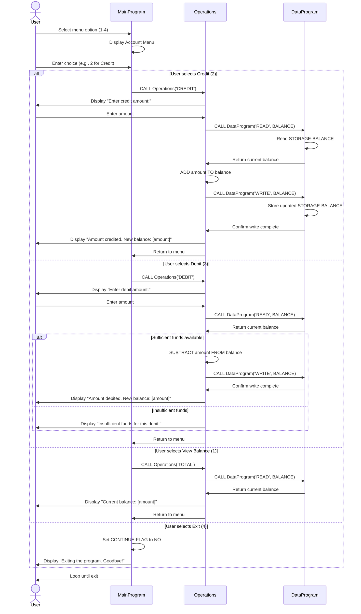

# COBOL Student Account Management System - Documentation

## Overview

This documentation describes the legacy COBOL application for managing student accounts. The system provides basic account operations including balance inquiry, credit, and debit transactions.

## COBOL File Structure

### 1. main.cob (MainProgram)

**Purpose:**
Main entry point and user interface controller for the Account Management System. Provides the interactive menu-driven interface for users to interact with the system.

**Key Functions:**
- `MAIN-LOGIC`: Displays a menu with four options (View Balance, Credit Account, Debit Account, Exit)
- Accepts user input and routes to appropriate operations
- Loops until user selects exit option (option 4)

**Input Parameters:**
- `USER-CHOICE`: Numeric input (1-4) from user selection

**Output:**
- Menu display and confirmation messages

**Error Handling:**
- Invalid choice validation (displays error for selections outside 1-4 range)

---

### 2. data.cob (DataProgram)

**Purpose:**
Data persistence layer for student account balance. Manages the actual account balance storage and provides read/write access to balance data.

**Key Functions:**
- `READ`: Retrieves the current account balance
- `WRITE`: Updates and stores the account balance

**Data Elements:**
- `STORAGE-BALANCE`: Maintains the student account balance (initial value: 1000.00)
- `OPERATION-TYPE`: Determines whether to read or write balance data

**Business Rules:**
- Initial balance is set to 1000.00
- All balance values are stored as numeric with 2 decimal places (PIC 9(6)V99)

---

### 3. operations.cob (Operations)

**Purpose:**
Implements business logic for account transactions. Handles all account operations including balance inquiry, credit, and debit transactions.

**Key Functions:**

#### TOTAL (View Balance)
- Reads the current balance from the data module
- Displays the balance to the user
- No amount validation required

#### CREDIT (Credit Account)
- Prompts user to enter credit amount
- Reads current balance
- Adds the amount to the balance
- Updates balance in storage
- Displays confirmation with new balance
- No validation on credit amount (allows any positive value)

#### DEBIT (Debit Account)
- Prompts user to enter debit amount
- Reads current balance
- **Validates sufficient funds:** Only processes debit if balance >= amount
- If approved: Subtracts amount and updates storage
- If rejected: Displays "Insufficient funds" message
- Displays confirmation with new balance (if approved)

**Data Elements:**
- `OPERATION-TYPE`: Specifies the operation (TOTAL, CREDIT, DEBIT)
- `AMOUNT`: User-provided transaction amount
- `FINAL-BALANCE`: Current account balance retrieved from storage

---

## Business Rules Summary

### Student Account Rules

1. **Initial Balance**: All student accounts start with a balance of 1000.00

2. **Balance Format**: All balances are maintained as numeric values with exactly two decimal places

3. **Credit Operations**:
   - Any credit amount > 0 is accepted
   - No upper limit validation
   - Immediately updates the account balance

4. **Debit Operations**:
   - Debits are only processed if the requested amount does not exceed available balance
   - Insufficient funds prevent the transaction (no overdraft allowed)
   - User receives notification when debit is rejected due to insufficient funds

5. **Transaction Flow**:
   - Read current balance from storage
   - Apply transaction logic
   - Write updated balance back to storage
   - Confirm transaction result to user

6. **Menu Navigation**:
   - User can perform unlimited transactions
   - Exit option (4) cleanly terminates the program
   - Invalid menu selections are caught and user is prompted again

---

## Data Flow Diagram

```
MainProgram (User Interface)
    ↓ (passes operation type)
Operations (Transaction Logic)
    ↓ (reads/writes balance)
DataProgram (Data Storage)
    ↓
STORAGE-BALANCE (Account Balance: 1000.00)
```

---

## Integration Points

- **MainProgram → Operations**: Menu selection passed as operation type
- **Operations → DataProgram**: Balance read/write operations with READ and WRITE commands
- **DataProgram → STORAGE-BALANCE**: Direct access to persistent account balance

---

## Application Data Flow - Sequence Diagram

The following Mermaid sequence diagram illustrates the typical data flow when a user interacts with the system:



---

## Future Modernization Considerations

- Replace COBOL with modern programming language (Java, Python, Node.js)
- Implement relational database for student account persistence
- Add authentication and authorization
- Implement logging and audit trails for transactions
- Add transaction history and reporting capabilities
- Implement input validation and error handling improvements
- Consider microservices architecture for scalability
